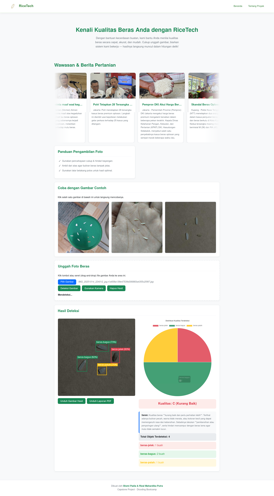

# Capstone Project: Deteksi Kualitas Beras (RiceTech)

Sebuah aplikasi web untuk menganalisis dan mendeteksi kualitas beras secara otomatis dari gambar menggunakan model *object detection* YOLOv8.



---

## 📖 Deskripsi

**RiceTech** adalah aplikasi web yang dibangun sebagai *capstone project* untuk mengklasifikasikan kualitas beras. Aplikasi ini menggunakan model *Deep Learning* (YOLOv8) yang telah dilatih untuk mengidentifikasi dan menghitung objek beras, seperti beras utuh dan beras patah.

Berdasarkan hasil deteksi, aplikasi akan menghitung rasio, memberikan penilaian kualitas (misalnya "Kualitas: C (Kurang Baik)"), dan memberikan ringkasan yang dapat diunduh oleh pengguna.

## ✨ Fitur Utama

* ⬆️ **Unggah Gambar:** Pengguna dapat mengunggah foto beras untuk dianalisis.
* 🤖 **Deteksi Objek:** Menggunakan model YOLOv8 (`best.pt`) untuk mendeteksi dan menghitung jumlah beras utuh, beras patah, dan objek lainnya.
* 📊 **Visualisasi Hasil:** Menampilkan gambar hasil deteksi dengan *bounding box* dan diagram lingkaran (*pie chart*) untuk distribusi kualitas.
* 📝 **Penilaian & Saran:** Memberikan *grade* kualitas (mis. A, B, C) dan saran berdasarkan hasil deteksi.
* 📄 **Unduh Gambar:** Pengguna dapat mengunduh Gambar yang sudah dideteksi.
* 📄 **Unduh Laporan PDF:** Pengguna dapat mengunduh ringkasan analisis lengkap dalam format PDF (dibuat menggunakan FPDF2).

---

## 🚀 Cara Penggunaan

1.  Buka aplikasi web di browser Anda.
2.  *Scroll* ke bagian **"Unggah Foto Beras"**.
3.  Klik tombol **"Pilih File"** dan pilih gambar beras yang ingin Anda analisis.
4.  Tekan tombol **"Deteksi Sekarang"**. Aplikasi akan memproses gambar.
5.  Lihat hasilnya di bagian **"Hasil Deteksi"**. Anda akan melihat:
    * Gambar asli dengan kotak-kotak deteksi.
    * Diagram lingkaran (*pie chart*) distribusi kualitas.
    * Penilaian akhir (misal: "Kualitas: C").
    * Rincian jumlah objek yang terdeteksi.
6.  Klik tombol **"Download PDF"** untuk menyimpan laporan analisis ke komputer Anda.

---

## 💻 Teknologi yang Digunakan

* **Machine Learning:** Ultralytics (YOLOv8)
* **Backend:** Flask
* **Frontend:** HTML, CSS, JavaScript (dengan Chart.js untuk diagram)
* **Pemrosesan Gambar:** Pillow (PIL)
* **Generasi Laporan:** FPDF2
* **Server WSGI:** Gunicorn
* **Deployment:** Railway

---

## 🔧 Tutorial Menjalankan Proyek di Lokal

Berikut adalah langkah-langkah detail untuk meng-install dan menjalankan proyek ini di komputer Anda.

### 1. Prasyarat (Prerequisites)

Pastikan Anda sudah meng-install perangkat lunak berikut:
* **Git:** Untuk mengunduh repositori.
* **Python (3.9+):** Untuk menjalankan aplikasi.

### 2. Langkah-langkah Instalasi

**Langkah 1: Clone Repositori**
Buka terminal Anda dan jalankan perintah `git clone` untuk menyalin file proyek ke komputer Anda.
```bash
git clone [https://github.com/Risaru9/Capstone_Projek_prediksi_kualitas_beras.git](https://github.com/Risaru9/Capstone_Projek_prediksi_kualitas_beras.git)

Langkah 2: Masuk ke Direktori Proyek Pindah ke folder proyek yang baru saja Anda clone.
Bash

cd Capstone_Projek_prediksi_kualitas_beras

Langkah 3: Buat Virtual Environment Sangat disarankan untuk menggunakan virtual environment (venv)
agar library yang Anda install tidak bercampur dengan proyek lain.
Bash

python3 -m venv venv

(Gunakan python jika python3 tidak ditemukan)

Langkah 4: Aktifkan Virtual Environment Perintahnya berbeda tergantung sistem operasi Anda.

    Untuk Windows (Command Prompt/PowerShell):
    Bash

.\venv\Scripts\activate

Untuk macOS/Linux (Bash/Zsh):
Bash

    source venv/bin/activate

Setelah berhasil, Anda akan melihat (venv) di awal baris terminal Anda.

Langkah 5: Install Semua Library yang Dibutuhkan Install semua library yang terdaftar di requirements.txt menggunakan pip.
Bash

pip install -r requirements.txt

Langkah 6: Dapatkan File Model (best.pt) File ini tidak ada di GitHub karena ukurannya besar (sesuai .gitignore).
Anda harus mengunduh file best.pt secara manual dari sumber lain (misal: Google Drive, dll.).

Letakkan file best.pt di dalam folder utama proyek (sejajar dengan file app.py).

Menjalankan Aplikasi

Setelah semua langkah instalasi selesai, jalankan aplikasi menggunakan perintah berikut:
Bash

flask run

Atau, jika perintah di atas tidak berhasil:
Bash

python app.py

Terminal akan menampilkan output yang memberitahu Anda bahwa server sedang berjalan, biasanya di alamat: * Running on http://127.0.0.1:5000

Buka Aplikasi di Browser

Buka browser web Anda (seperti Chrome atau Firefox) dan masukkan alamat http://127.0.0.1:5000.
Sekarang Anda dapat menggunakan aplikasi RiceTech secara lokal!


